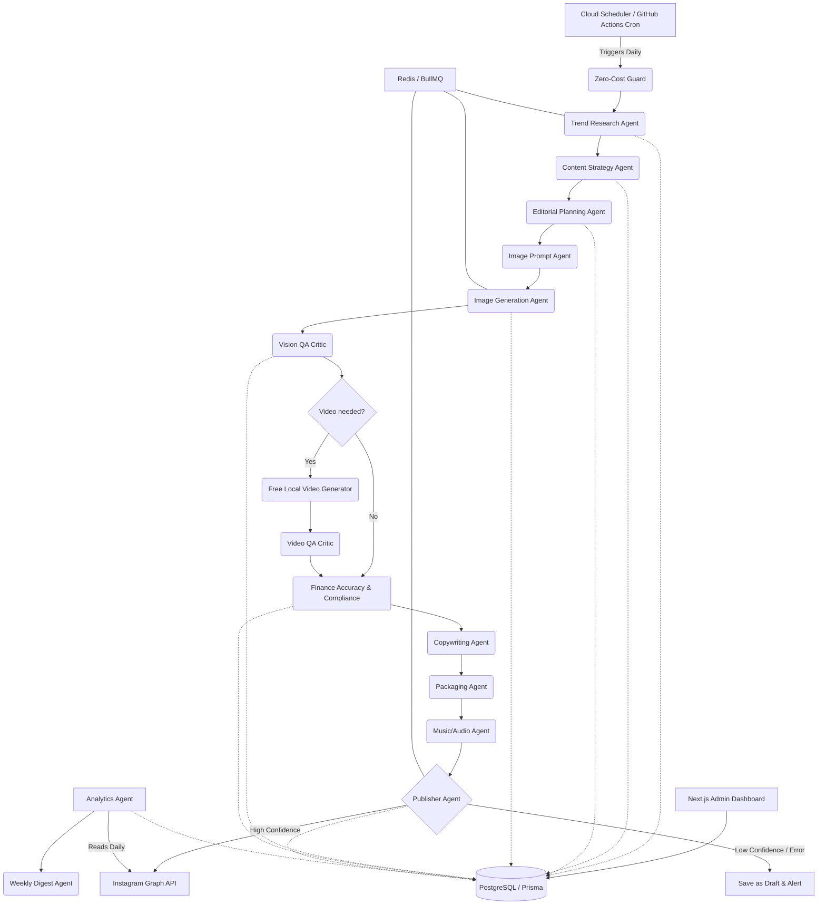

# Architecture Document & Implementation Plan

## 1. System Architecture Diagram

## 2. Core Stack Components
- **Framework**: Next.js 14 (App Router) for Admin Dashboard & API Routes
- **Database**: PostgreSQL with Prisma ORM
- **Queue/Orchestration**: Redis + BullMQ (Handles multi-step agent workflows with retries)
- **AI Models**: OpenAI GPT-4o (Agents, Copy, Finance Checks), DALL-E 3 (Image Generation)
- **Video Rendering**: Free local FFmpeg MP4 rendering from approved carousel frames; optional open-source text-to-video models can be explored separately if local GPU capacity exists.
- **Zero-Cost Mode**: Paid image/video APIs are blocked by default; daily cloud runs use local Sharp images and FFmpeg video rendering only.
- **Deployment**: Google Cloud Run (Next.js app & background worker), Cloud Scheduler (Cron), Cloud Storage (Assets)
- **Auth**: NextAuth / simple auth for Admin Dashboard

## 3. Implementation Plan

### Phase 1: Foundation & Data Layer
- Scaffold Next.js Monorepo structure.
- Setup PostgreSQL, Prisma, and define full `schema.prisma`.
- Setup Redis & BullMQ for job orchestration.
- Define internal base agent interfaces and LLM service abstractions.

### Phase 2: Core Agents Implementation
- **Trend Research & Strategy**: Implement daily trend extraction and topic scoring.
- **Editorial & Copywriting**: Generating structured post briefs and captions.
- **Image Generation Pipeline**: Implement DALL-E integration, prompts generation, vision QA, and asset storage (GCS/Local for MVP).
- **Compliance & Accuracy**: Implement factual checks against structured sources.

### Phase 3: Publishing & Orchestration
- **Instagram Graph API**: Implement OAuth, token refresh, and Publishing flows (single image, carousel).
- **Workflow Orchestrator**: Tie all agents together in a BullMQ flow (Step 1 to Step 10).
- Implement Fail-safe logic and confidence scoring aggregation.

### Phase 4: Admin Dashboard
- Build the UI to view active jobs, drafted posts, generated assets.
- Implement manual override, approvals, and confidence reports.

### Phase 5: Analytics & Delivery
- Implement delayed analytics collection.
- Implement Weekly Digest generation.
- Dockerize the app and provide deployment scripts for Google Cloud.

## 4. Environment Variables Required
- `DATABASE_URL`
- `REDIS_URL`
- `OPENAI_API_KEY`
- `INSTAGRAM_ACCESS_TOKEN`
- `INSTAGRAM_ACCOUNT_ID`
- `GCP_PROJECT_ID`
- `GCS_BUCKET_NAME`
