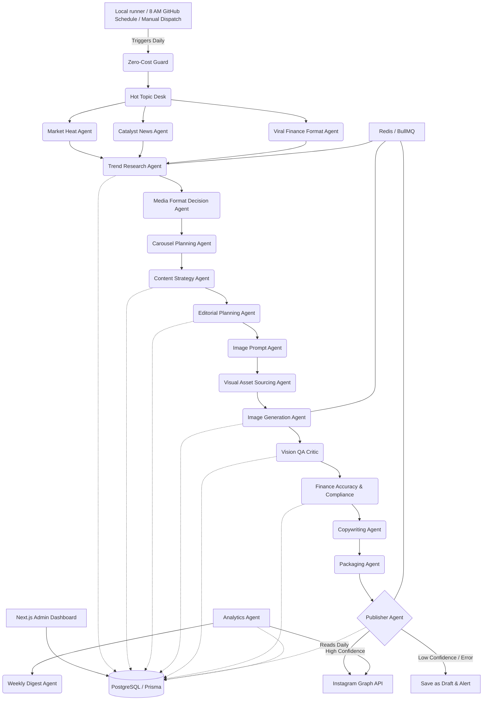

# Architecture Document & Implementation Plan

## 1. System Architecture Diagram

## 2. Core Stack Components
- **Framework**: Next.js 14 (App Router) for Admin Dashboard & API Routes
- **Database**: PostgreSQL with Prisma ORM
- **Queue/Orchestration**: Redis + BullMQ (Handles multi-step agent workflows with retries)
- **AI Models**: Gemini text models for agents/copy/research, with paid image APIs disabled by default.
- **Hot Topic Desk**: Free ticker heat scan, catalyst/news mapping, and viral-format conversion before final strategy selection.
- **Media Planning**: Separate agents decide single picture vs carousel, then slide count and frame roles before the strategist writes the final brief.
- **Visual Sourcing**: A free/legal sourcing layer chooses Cloudflare original backgrounds, optional Pexels assets, optional Wikimedia Commons assets, or local fallback. Google Images scraping and Google Photos sourcing are not used.
- **Picture Rendering**: Free local Sharp PNG rendering from generated carousel briefs; optional Cloudflare Workers AI or licensed-source backgrounds can be composited under exact local typography for full-bleed market-news posters. The daily automation is picture-only.
- **Zero-Cost Mode**: Paid image/video APIs are blocked by default; Cloudflare Workers AI is allowed only with the capped free-allocation Flux Schnell model and local Sharp fallback.
- **Deployment**: GitHub Actions for the standalone daily picture workflow; the longer-term dashboard/worker architecture can still run on Cloud Run, Cloud Scheduler, and Cloud Storage.
- **Auth**: NextAuth / simple auth for Admin Dashboard

## 3. Implementation Plan

### Phase 1: Foundation & Data Layer
- Scaffold Next.js Monorepo structure.
- Setup PostgreSQL, Prisma, and define full `schema.prisma`.
- Setup Redis & BullMQ for job orchestration.
- Define internal base agent interfaces and LLM service abstractions.

### Phase 2: Core Agents Implementation
- **Trend Research & Strategy**: Implement daily trend extraction, hot-topic desk scoring, catalyst mapping, and topic scoring.
- **Editorial & Copywriting**: Generating structured post briefs and captions.
- **Image Generation Pipeline**: Implement zero-cost local Sharp rendering, optional capped Cloudflare Workers AI background generation, prompts generation, vision QA, and asset storage (GCS/Local for MVP).
- **Compliance & Accuracy**: Implement factual checks against structured sources.

### Phase 3: Publishing & Orchestration
- **Instagram Graph API**: Implement OAuth, token refresh, and Publishing flows (single image, carousel).
- **Workflow Orchestrator**: Tie all agents together in a BullMQ flow (Step 1 to Step 10).
- Implement Fail-safe logic and confidence scoring aggregation.

### Phase 4: Admin Dashboard
- Build the UI to view active jobs, drafted posts, generated assets.
- Implement manual override, approvals, and confidence reports.

### Phase 5: Analytics & Delivery
- Implement delayed analytics collection.
- Implement Weekly Digest generation.
- Dockerize the app and provide deployment scripts for Google Cloud.

## 4. Environment Variables Required
- `DATABASE_URL`
- `REDIS_URL`
- `OPENAI_API_KEY`
- `CLOUDFLARE_ACCOUNT_ID`
- `CLOUDFLARE_API_TOKEN`
- `CLOUDFLARE_WORKERS_AI_ENABLED`
- `ENABLE_LICENSED_ASSET_SOURCING`
- `PEXELS_API_KEY`
- `ENABLE_WIKIMEDIA_SOURCING`
- `WIKIMEDIA_USER_AGENT`
- `GEMINI_API_KEY`
- `HOT_TOPIC_WATCHLIST`
- `TELEGRAM_BOT_TOKEN`
- `TELEGRAM_CHAT_ID`
- `GMAIL_ADDRESS`
- `GMAIL_APP_PASSWORD`
- `DELIVERY_EMAIL`
- `INSTAGRAM_ACCESS_TOKEN`
- `INSTAGRAM_ACCOUNT_ID`
- `GCP_PROJECT_ID`
- `GCS_BUCKET_NAME`
